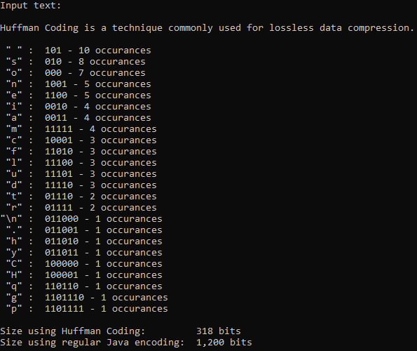

<h1 align="center"> 🌳 Huffman Coding 🌳 </h1>

Huffman Coding is a technique commonly used for lossless data compression. It consists in atributing smaller codes to characters that appear more frequently in a text and bigger ones to characters that appear less frequently, which means it uses variable-lenght codes. It also uses prefix codes, so the fact that no code is the prefix of another code assures there's no ambiguity when decoding data.

This program reads a text until EOF, generates the Huffman Tree, using an auxiliar priority queue (Heap), and prints the frequency and Huffman Coding code of all characters used in it (both the heap and the Huffman tree are implemented). After that, it informs the size of the text using Huffman Coding compared to the size using regular Java encoding (UTF-16).

To produce EOF in Windows Powershell, press CTRL+Z and then enter (you have to press enter before EOF too for it to work, I don't really know why).

